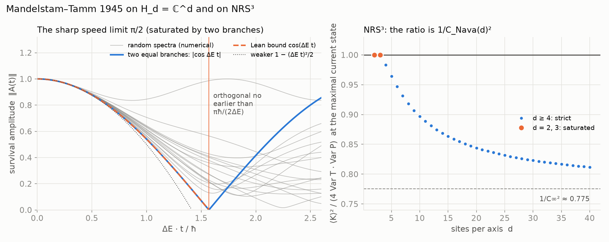
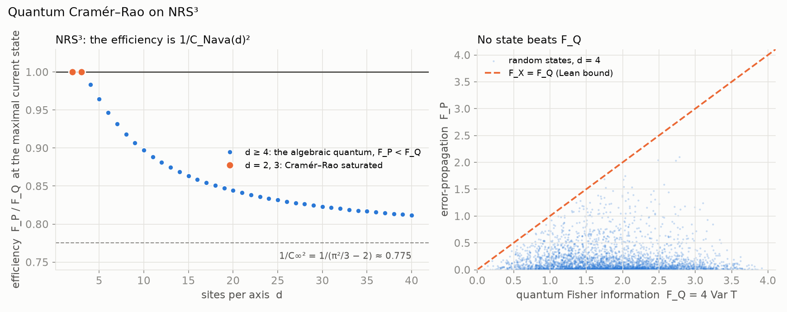

# NRS³ · Mandelstam–Tamm and Cramér–Rao

Two faces of one inequality, in Lean 4. **No quantum state becomes orthogonal to itself before
`πħ / (2ΔE)`** (Mandelstam–Tamm, sharp constant), and **no measurement extracts more information
about a phase than `4 Var H`** (quantum Cramér–Rao). Both come from Robertson's inequality with the
energy spread `ΔE`: one bounds how fast a state moves, the other how well that motion can be read.

**[▶ Try it: move the time and watch the phasors](https://naype888-cloud.github.io/nrs3-mandelstam-tamm-cramer-rao/)** ·
**[▶ Try it: turn the phase and watch δT and δP](https://naype888-cloud.github.io/nrs3-mandelstam-tamm-cramer-rao/cramer-rao.html)**



## Mandelstam–Tamm

| Statement | Lean |
|---|---|
| `‖A(t)‖ ≥ cos(ΔE t)` while `ΔE t ≤ π/2`, for every finite spectrum | `cos_le_norm_amplitude` |
| orthogonality forces `ΔE t ≥ π/2` | `orthogonality_time` |
| two equal branches meet it with equality: `π/2` is sharp | `norm_amplitude_half_eq_cos` |
| on `H_d = ℂ^d`: the Schrödinger evolution of a self-adjoint `H` has exactly this amplitude | `hasDerivAt_evolve`, `inner_evolve` |
| the bound on `ℂ^d` | `cos_le_norm_inner_evolve` |

`A(t) = ⟨ψ, e^{−iHt/ħ}ψ⟩` is the survival amplitude and `ΔE` the energy spread. It is the sum of
the arrows `p_k e^{−iE_k t}`; its tip never enters the disc of radius `cos(ΔE t)`:


### In NRS³

On the NRS³ pair `T_d : P_d` the same inequality bounds the speed of `⟨P_d⟩` by the spread of
transport, and at the maximal-tension state the ratio is `1 / C_Nava(d)²`: equality only at
`d = 2, 3` (`GroupVelocity.mandelstamTamm`, `GroupVelocity.mtRatio_maxCurrentState`, `D41` in the base
repository). Right panel of the figure; the values there are numerical.

### History

Mandelstam and Tamm (1945) derived the bound from Robertson's inequality for the energy and the
projector on the initial state. The proof here follows that route: `P = ‖A‖²` obeys
`P' ≥ −2ΔE √(P(1 − P))`, and a fencing argument against `cos²` gives the sharp constant.

## Cramér–Rao



| Statement | Lean |
|---|---|
| `⟪δA, δB⟫ − ⟪δB, δA⟫ = ⟨[A, B]⟩` | `inner_dev_sub` |
| Robertson: `‖⟨[A, B]⟩‖² ≤ 4 Var A · Var B` | `robertson` |
| Cramér–Rao: `F_X = ‖⟨[H, X]⟩‖² / Var X ≤ F_Q = 4 Var H` | `fisher_le_qfi` |

For symmetric operators on any complex inner product space, in particular `ℂ^d`. `F_X` is the
error-propagation Fisher information of reading `θ` with `X` after `e^{−iθH}`; `F_Q = 4 Var H` is
the quantum Fisher information of a pure state, taken here as its definition.

### In NRS³

On NRS³ the parameter is imprinted by transport `T_d` and read with position `P_d`. At the
maximal-tension state the efficiency `F_P / F_Q` is `1 / C_Nava(d)²`: exactly `1` at `d = 2, 3`
and strictly below from `d = 4` on, towards `1/(π²/3 − 2) ≈ 0.775` (`GroupVelocity.cramerRao`,
`GroupVelocity.mtRatio_maxCurrentState`, `D41` in the base repository). At `d = 4` it is
`5 / (99 − 42√5) ≈ 0.9833`.

### History

Helstrom (1967) and Braunstein–Caves (1994). The identity `d⟨X⟩/dθ = ⟨i[H, X]⟩` that turns
Robertson into an estimation bound is the Heisenberg equation; on `T_d : P_d` it is `D38` of the
base repository, and it is not re-proved here.

## Build

Lean 4 `v4.34.0`, Mathlib `v4.34.0`, nothing else.

```bash
lake exe cache get
lake build
lake env lean Verification/Axioms.lean   # only propext, Classical.choice, Quot.sound
```

Every file: no `sorry`, lines of at most 100 characters, English headers.

## Timeline 1911–1945

NRS answers a question of the Solvay era with later tools. The series is placed in that window:
what falls inside it is the history the theorem belongs to; what falls after it is a proposal,
not part of NRS³.

| Year | Event | Repository |
|---|---|---|
| 1911 | First Solvay conference: radiation and the quanta | |
| 1911–12 | Poincaré: Planck's law forces discrete levels | [`nrs3-poincare`](https://github.com/naype888-cloud/nrs3-poincare) |
| 1915–20 | Szegő: limit theorems for Toeplitz matrices (the limit `C∞`, `D8`) | [base repository (NRS, NRS³)](https://github.com/naype888-cloud/nava-robertson-schrodinger) |
| 1917–27 | Einstein and de Sitter: `Λ` and the empty universe; Friedmann and Lemaître: the expanding universe | [`nrs3-de-sitter`](https://github.com/naype888-cloud/nrs3-de-sitter) |
| 1925–27 | Pauli: exclusion, shells `2n²`, spin matrices | [`nrs3-pauli-dirac`](https://github.com/naype888-cloud/nrs3-pauli-dirac) |
| 1927 | Heisenberg's relation; fifth Solvay conference: electrons and photons | |
| 1928 | Dirac: the `4 × 4` gamma matrices | [`nrs3-pauli-dirac`](https://github.com/naype888-cloud/nrs3-pauli-dirac) |
| 1929 | van der Waerden: spinors, `SL(2, ℂ)` on Hermitian matrices; the uncertainty cone | [`nrs3-uncertainty-cone`](https://github.com/naype888-cloud/nrs3-uncertainty-cone) |
| **1929–30** | **Robertson and Schrödinger: the uncertainty inequality** | **[base repository (NRS, NRS³)](https://github.com/naype888-cloud/nava-robertson-schrodinger)** |
| 1945–46 | Mandelstam–Tamm: the time–energy bound; Rao (1945), Cramér (1946) | **[`nrs3-mandelstam-tamm-cramer-rao`](https://github.com/naype888-cloud/nrs3-mandelstam-tamm-cramer-rao)** (this one) |

**Tools from after the window.** Niven (1956: rational values of the trigonometric functions),
Fiedler (1973: algebraic connectivity), Lean 4 and Mathlib (the verification). The question is
of 1929; the tools are later; the checking is of 2026.

**After the window: proposals, not NRS³.** [`nrs3-penrose`](https://github.com/naype888-cloud/nrs3-penrose) (Penrose 1996, gravity-related
collapse) and [`nrs3-rovelli-lqg`](https://github.com/naype888-cloud/nrs3-rovelli-lqg) (loop quantum gravity, area spectrum 1995). They use NRS³ results
but their physical readings belong to quantum information and quantum gravity.
[`nrs3-defect-curvature`](https://github.com/naype888-cloud/nrs3-defect-curvature) restates base theorems (`D16`–`D16i`); its Bekenstein–Hawking (1973–75) reading
is a declared bridge.

## The mosaic

- [NRS and NRS³ — the base theorem](https://github.com/naype888-cloud/nava-robertson-schrodinger)
- **[NRS³ · Mandelstam–Tamm and Cramér–Rao](https://github.com/naype888-cloud/nrs3-mandelstam-tamm-cramer-rao)** (this one)
- [NRS³ · Landauer and Carnot](https://github.com/naype888-cloud/nrs3-landauer-carnot)
- [NRS³ · de Sitter](https://github.com/naype888-cloud/nrs3-de-sitter)
- [NRS³ · Penrose](https://github.com/naype888-cloud/nrs3-penrose) (proposal)
- [NRS³ · Pauli–Dirac](https://github.com/naype888-cloud/nrs3-pauli-dirac)
- [NRS³ · The uncertainty cone](https://github.com/naype888-cloud/nrs3-uncertainty-cone)
- [NRS³ · Poincaré](https://github.com/naype888-cloud/nrs3-poincare)
- [NRS³ · Defect and curvature](https://github.com/naype888-cloud/nrs3-defect-curvature)
- [NRS³ · Rovelli — Loop Quantum Gravity](https://github.com/naype888-cloud/nrs3-rovelli-lqg) (proposal)
- [NRS³ · Dark](https://github.com/naype888-cloud/nrs3-dark)

## License

NRS Noncommercial License 1.0.0, see [`LICENSE`](LICENSE). Author: Eduardo Nava-Hernandez.
